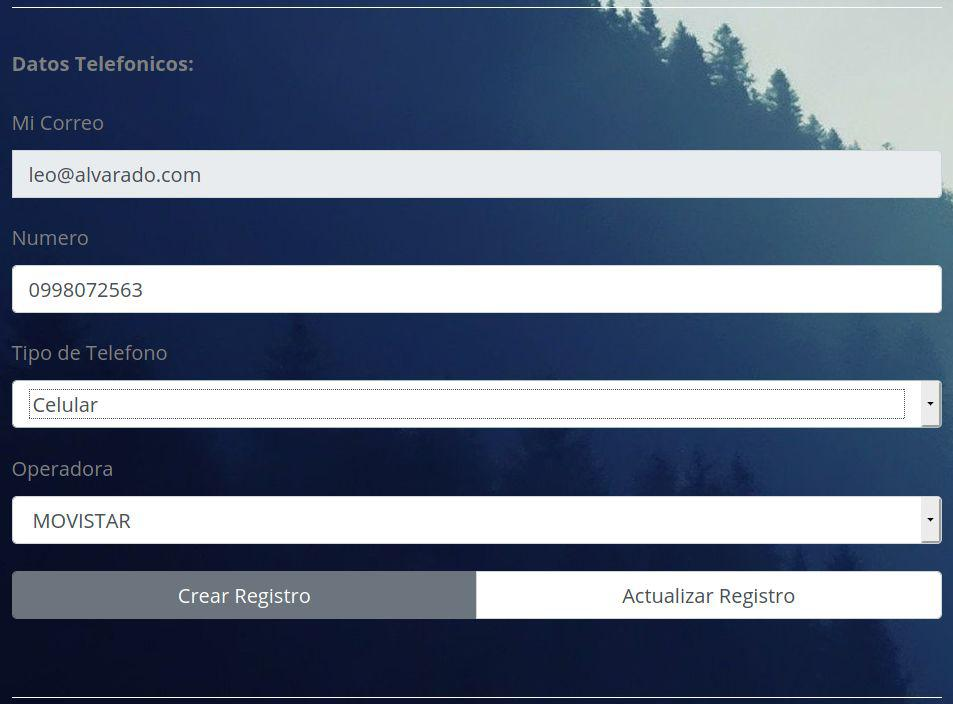
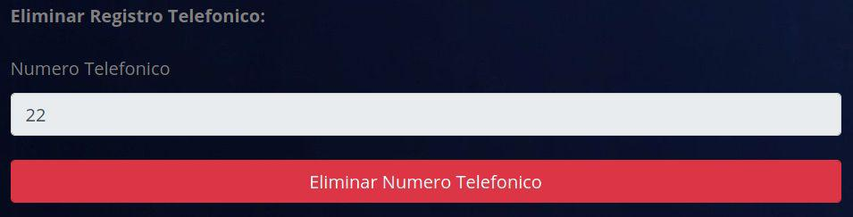
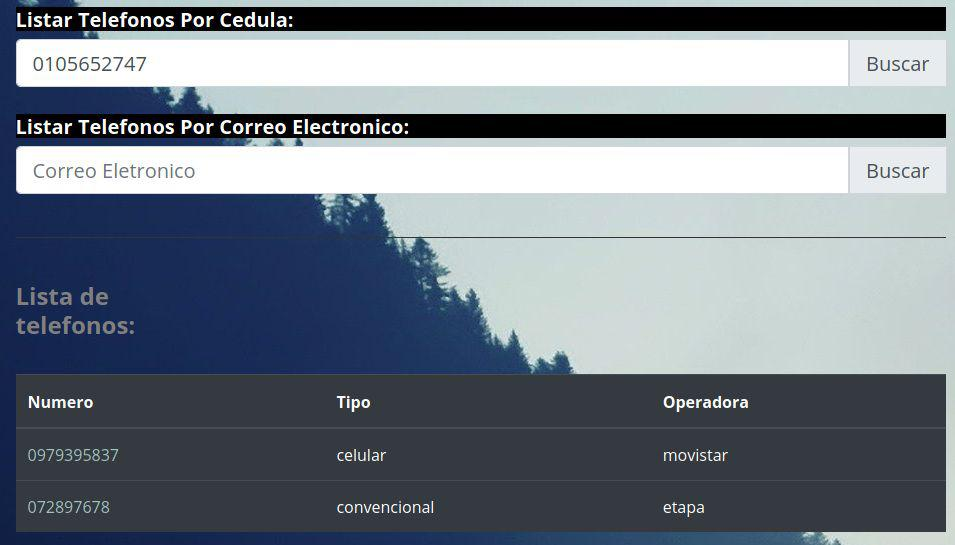

# Plataformas Web

### NRO. PRÁCTICA​: 2 
### TÍTULO PRÁCTICA​: Desarrollo de aplicaciones usando Java EE, Mysql y patrones de diseno.

### OBJETIVO ALCANZADO:

#### Se pudo completar la práctica satisfactoriamente haciendo uso de tecnologías como Java EE, Javascript, Mysql, y patrones de diseño como MVC y DAO.

### 1. Crear un repositorio en GitHub con el nombre “Práctica de laboratorio 01: Servlets, JSP y JDBC”

### 2. Desarrollar una aplicación con tecnología JEE para gestionar una agenda telefónica en la web.

#### Base de datos:

### Páginas de la aplicación:

##### Crear registros telefónicos:

#### Listar Mis Teléfonos:

#### Modificar Teléfono:

##### Cambio de operadora de Movistar a CNT.

#### Buscar Numero Telefónico:

##### En el caso de que no se haya encontrado un registro se muestra un mensaje.

#### Eliminar Registro:

##### Ya no se muestra ningún registro ya que el único que se encontraba asociado se eliminó.

#### Listado de números telefónicos a través de un numero de cédula:

#### Listado de números telefónicos a través de un correo electrónico:

### 3. Realizar varios commits en la herramienta GitHub que demuestren el desarrollo de la aplicación.

### RESULTADO(S) OBTENIDO(S)​:

#### Se pudo completar la práctica con un cierto grado de dificultad ya que en ciertas ocasiones el servidor Tomcat provoca errores en conjunto con el IDE Eclipse, por lo que se debe tener un respaldo del servidor. Aparte de lo antes mencionado, se pudo realizar la aplicación de Agenda Telefónica con todos los parámetros requeridos, además de que se puso en práctica los patrones DAO para lograr un mayor nivel de abstracción en nuestra aplicación.

### CONCLUSIONES​:

### Por medio de la práctica culminada se puede concluir que las tecnologías de Java para el desarrollo de aplicaciones Web son sumamente importantes, ya que son mucho más robustas que otros lenguajes como PHP, además de proveer una mayor seguridad por medio de la implementación de filtros y sesiones.

### RECOMENDACIONES​:
#### Es de gran importancia revisar las diapositivas vistas en clase, ya que estas solventan dudas que pueden aparecer de manera frecuente, además, también es recomendable leer la documentación de la herramienta (servidor en este caso) para resolver problemas que se tengan a la hora de ejecutar nuestra aplicación.

### Nombre de estudiante ​: Leonardo Alvarado Torres.

### Firma de estudiante ​:
